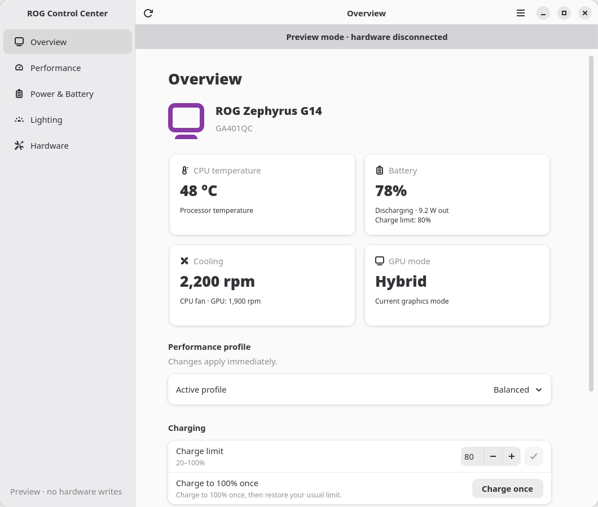
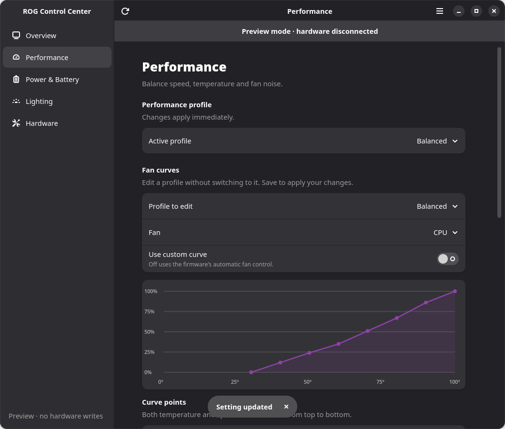

# ROG Control Center — GNOME edition

A native GTK4 and libadwaita interface for `asusd`, written in Python with
PyGObject. It uses the existing system daemon over D-Bus; no daemon replacement
or root GUI is needed. Appearance follows GNOME, including light/dark mode and
the system accent colour.



## Run from this checkout

On Arch Linux, the UI dependencies are:

```sh
sudo pacman -S gtk4 libadwaita python-gobject python-cairo
```

The UI requires Python 3.10+, GTK 4.12+ and libadwaita 1.5+. Use the existing
`asusd` 6.5 service. On Debian/Ubuntu, the corresponding packages are
`python3-gi`, `python3-gi-cairo`, `gir1.2-gtk-4.0` and `gir1.2-adw-1` on a release
with those minimum GTK/libadwaita versions.

```sh
# Real laptop controls; uses the installed asusd service.
./rog-control-center/rog-control-center

# Isolated preview with sample hardware; no system-bus or hardware access.
./rog-control-center/rog-control-center --demo
```

The launcher works from any current directory. `make run-rog_gui` and
`make preview-rog_gui` are equivalent shortcuts. GTK selects the available
Wayland or X11 backend at runtime.

## Navigation

- **Overview:** model, CPU temperature, battery charge/power/limit, fan speeds,
  GPU mode and the active performance profile. Each status card opens its related
  settings section. Charge-limit editing and one-time full charging are available
  directly on this page; Quick access links are retained.
- **Performance:** profiles, custom fan curves, CPU energy preferences, graphics
  mode and power tuning. Drag graph points, or expand the exact-value editor. A curve is
  saved explicitly; both temperature and fan speed must be non-decreasing.
  The power-tuning control explains when an enabled custom curve is required.
  Current graphics mode and queued changes are shown separately. Scheduling a
  change requires confirmation; the app never restarts the laptop.
- **Power & Battery:** charge limit, one-time full charge, battery health and
  automatic profiles for AC and battery power.
- **Lighting:** Aura brightness, supported effects, primary/secondary colours,
  speed, direction, zones and power triggers. AniMe Matrix, Slash and XG Mobile
  settings appear when their interfaces are present.
- **Hardware:** display/firmware settings and laptop information.

Controls come from daemon discovery and introspection. Unsupported settings
are hidden; read-only firmware values remain read-only. Settings that require
confirmation, such as GPU changes, remain on their current values until
confirmed. Hardware writes and refreshes run on a serial worker, so an
unresponsive daemon does not block the interface. A disconnected daemon shows
a recovery state and disables stale controls until reconnection.

The sidebar becomes back-button navigation on narrow windows. `Ctrl+1` through
`Ctrl+5` open the pages, `Ctrl+R` refreshes and `Ctrl+Q` closes the window. The menu
contains appearance choices, shortcuts and application information. Colours
chosen manually apply for the current session; GNOME is the default.



## Install only the new UI

When the distro's daemon is already installed, the UI does not need a Rust
build. To install separately under `/usr/local`:

```sh
sudo make install-rog_gui install-data-rog_gui prefix=/usr/local
```

For packaging, `DESTDIR` is supported:

```sh
make install-rog_gui install-data-rog_gui DESTDIR=/tmp/rog-package prefix=/usr
```

`make build` builds the Rust daemon/CLI workspace without the old Slint frontend,
then checks the Python sources. `make install` installs the GNOME UI alongside
those binaries. Runtime packages must include the Python, GTK and libadwaita
dependencies above.

The original Rust/Slint sources are retained for upstream comparisons. They can
still be built with `make build-slint`; `make install-rog_gui-slint` installs that
frontend as `rog-control-center-slint`.

The GNOME frontend is a foreground settings application. The daemon retains
profiles, power automation and hardware settings after the window closes. The
old frontend's tray, background notification service, custom shell commands and
global shortcut portal are not run by the GNOME frontend. Its existing RON
configuration is left untouched. The new UI currently uses English; the
retained Slint translation catalogues do not translate it.

## Verification

```sh
# Protocol, curve validation, preview isolation and GPU queue/rollback checks.
make check-rog_gui

# Real GTK widgets; writes only to the isolated preview backend.
PYTHONPATH=rog-control-center/gnome python3 rog-control-center/gnome/tests/smoke_ui.py

# Live service discovery and all five pages; no hardware writes.
PYTHONPATH=rog-control-center/gnome python3 rog-control-center/gnome/tests/smoke_ui.py --live

# Optional screenshots of the preview in desktop and narrow light/dark layouts.
PYTHONPATH=rog-control-center/gnome python3 rog-control-center/gnome/tests/smoke_ui.py --screenshots /tmp/rog-screenshots
```

GTK smoke checks need a graphical session. In CI they run under Xvfb and a
private session bus. They check navigation, layout minima, staged editing,
refresh/discard behaviour, curve saves and preservation of raw fan PWM values.
Screenshots in this README use sample data from preview mode.
